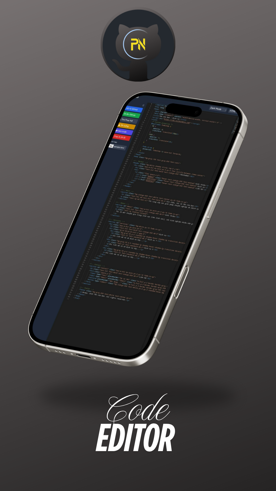

# 🌐 Code Editor

> Trình chỉnh sửa mã nguồn hiện đại, miễn phí, chạy hoàn toàn trên trình duyệt, tích hợp GitHub.

## 🧩 Tính năng nổi bật

- ✍️ **Soạn thảo mã nguồn đa ngôn ngữ** với [Monaco Editor] – nền tảng của VS Code.
- 🚀 **Tích hợp GitHub**:
  - Đọc, sửa và push file lên GitHub trực tiếp.
  - Hỗ trợ token bảo mật và repo cá nhân.
- 🌐 **Chạy hoàn toàn trên trình duyệt** (không cần cài đặt, không cần máy tính).
- 📲 **Hỗ trợ PWA**:
  - Cài như ứng dụng.
  - Hoạt động offline (lưu local, đồng bộ lại khi online).
- 🎨 **Chọn giao diện** (sáng, tối, tương phản cao) và cỡ chữ.
- 📄 **Xem trước HTML và Markdown** trực tiếp.
- 🧠 **Auto detect ngôn ngữ** từ nội dung hoặc phần mở rộng.

## 🔥 Trải nghiệm ngay

👉 Trang Chủ: [Xem Tại Đây](https://phucnguyengroups.github.io)

---

## ⚙️ Công nghệ sử dụng

| Công nghệ         | Mô tả |
|------------------|------|
| [Monaco Editor]  | Trình chỉnh sửa mã mạnh mẽ của VS Code |
| GitHub REST API  | Giao tiếp, đọc/ghi file lên GitHub |
| [Tailwind CSS]   | Tối ưu hóa giao diện đơn giản, hiện đại |
| [Marked.js]      | Parse Markdown nhanh chóng |
| Service Worker   | Hỗ trợ PWA và cache offline |
| JavaScript ES6+  | Viết sạch, tối ưu cho thiết bị di động |

---

## 📄 Giấy phép

Phát hành dưới [MIT License](LICENSE.txt).  
Bạn được **toàn quyền sử dụng, sửa đổi, thương mại hóa** – miễn ghi rõ nguồn gốc.

---

### 👤 Tác giả

- **Phúc Nguyễn Groups**
- GitHub: [@phucnguyengroups](https://github.com/phucnguyengroups)

---

### ⭐️ Nếu bạn thấy dự án có ý nghĩa:

- Hãy **Star** ⭐ trên GitHub để ủng hộ
- Chia sẻ với bạn bè để họ cũng không cần dùng đến máy tính mà vẫn lập trình được

